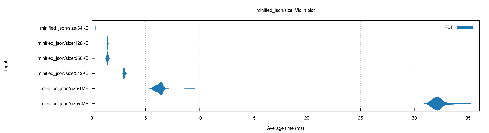
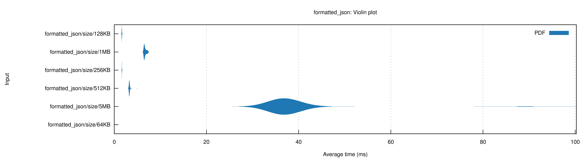

# jtools

CLI tools for working with JSON written in Rust.

**Aim**

Manage JSON without relying on an online tool, ensuring clear and concise error reporting to
make debugging easier.

**Features**

- Error reporting inspired by Rust for example:

```text
Unterminated string
  +|
   |
16 |"message": "Hello,
   |           ^___
  +|
```
- Handwritten scanner/lexical analyser
- Recursive descent parser
- Formatter
- Minifier
---

## Usage

To see all available commands run:

```bash
jtools -h

# OR

jtools --help
```

## Examples (zsh or bash)

A few useful commands that can be combined with shell features:

* Format data and copy the result to the clipboard

```bash
jtools format -w file "data.json" | pbcopy
```

* Minify data and redirect the output to a new file without overriding the original

```bash
jtools minify -w file -p "data.json" > "data-min.json"
```

* Format data from standard input and append the output to a file

```bash
jtools format -s 2 -w text '{ "message": "Hello, World!" }' >> "data.json"
```

## Parser Design

The parser was built from the following custom Context Free Grammar (CFG):

```
json := literal ;
object := "{" ( property ( "," property )* )* "}" ;
property := string ":" literal ;
array := "[" ( literal ( "," literal )* )* "]" ;
literal := string | number | "true" | "false" | "null" | object | array ;
```

Note: Both string and number have not been expanded for readability and whitespace is ignored. See
[RFC 8259](https://datatracker.ietf.org/doc/html/rfc8259#section-7) for the JSON specification

## Performance

Always take benchmark tests with a pinch of salt!

* Benchmarker
    * [Criterion](https://crates.io/crates/criterion/) is used to perform all benchmark tests
* Data
    * [Test JSON data](https://microsoftedge.github.io/Demos/json-dummy-data/) used in all of the tests

### MacBook Pro 2021

* Chip - Apple M1 Pro
* Memory 16GB

#### Parse minified JSON


#### Parse formatted JSON


---
